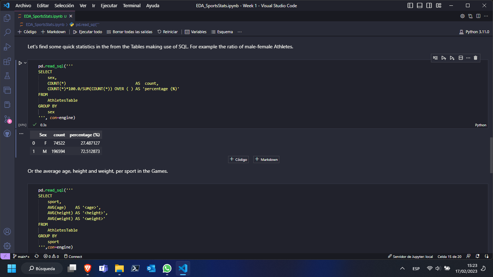
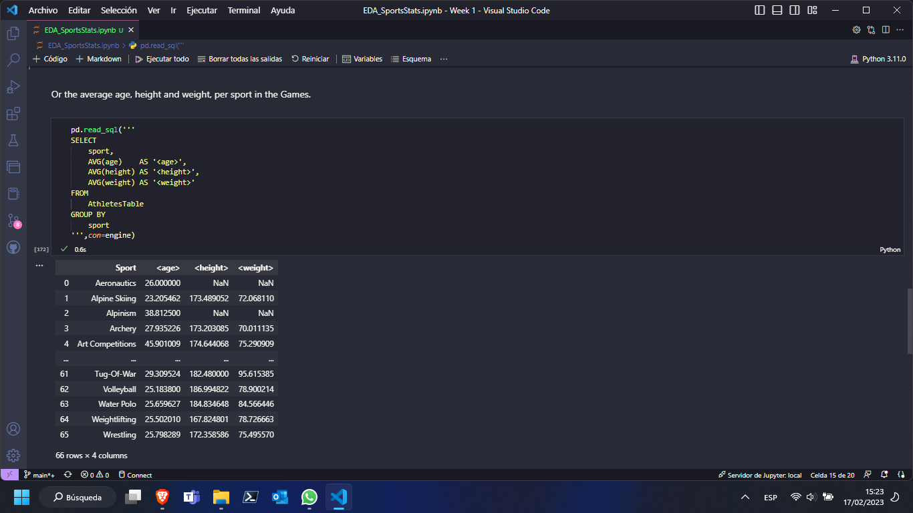
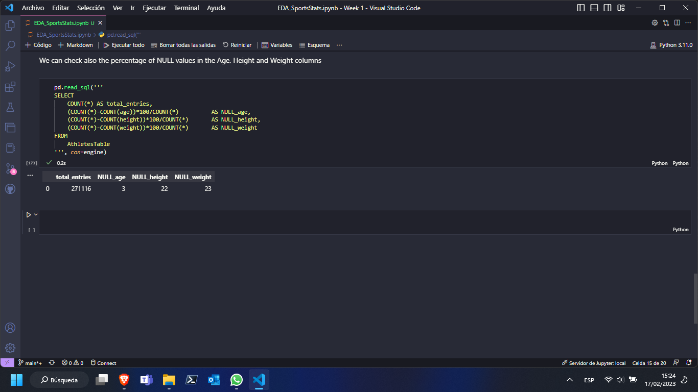
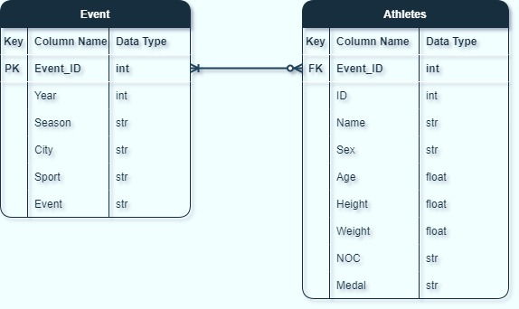

# Milestone 1: Project Proposal and Data Selection/Preparation

**Step 1: Preparing for Your Proposal**

1. Which client/dataset did you select and why?
   
    *I have chosen 'Client 3: SportsStats' with the Olympics Dataset for 120 years of data. The fact that I have chosen this client is that I spend a lot of my free time practicing sports, and I would like to get interesting insights from the dataset. in addition, the .csv files are not large and can be easily handled.*

2. Describe the steps you took to import and clean the data.
   
    *First, the data was downloaded and stored locally since the volume of files is not big, and does not require Databricks or several clusters to work with. I have used my own customized VSCode text editor for coding and querying since I am used to it. I have also used Excel to check the integrity of the data and both datasets appear to be OK.*

    *Second, I have used pandas from Python to read the .csv files, and the built-in to_sql() function to store the data in a MySQL dataset.*

    *Third, I checked the amount of NaN or NULL values to know how to deal with them, and remove them or not.*

3. Perform an initial exploration of data and provide some screenshots or display some stats of the data you are looking at.
   
   *This preliminary or initial EDA has been carried out with Pandas and Pandas SQL libraries to query the data. Other libraries like seaborn and numpy has been used to help the EDA.*

   *I have performed a quick EDA with simple queries. The athlete_events.csv contains 271116 entries. Some columns can be dropped, since are not relevant to this analysis, for example, the 'Team' column contains some character in the string that should be removed (e.g.: Poland-1). This is more tedious than just using the 'NOC' since it gives us the same information. Additionally, the 'Games' column is not going to be used, and we have this same information with columns 'Year' and 'Season'. Dropping these columns will not reduce the volume of data significantly like notice a speed-up in queries but would keep the data frame cleaner and simpler.*
   
   *An initial EDA with basic queries shows that there are 271116 entries or Event_ID, while there are entries that are fully completed (Sex, years, season...) and do not contain missing values, there are some others like Age, Height, and Weight, that show missing values.*

    
    
    

4. Create an ERD or proposed ERD to show the relationships of the data you are exploring.

    *The ERD shown below was intended for a small relational database, splitting them into two tables, the athletes and the event. Some modifications have been needed, for example, the column 'ID' had no unique values, so it could not be used as a primary key (PK), so a new column "Event_ID" in the 'Event' table has been added as a PK, and as a FK in the 'Atheletes' Table.*
    
    

**Step 2: Develop a Project Proposal**

**Description**

*The purpose of this project is to get some insight from the data to obtain several statistics based on athletes during different Olympic events in the last 120 years. The audience could be directed to sports enthusiasts and followers, or even coaches/trainers might find them useful. This data might be also relevant for Sports media and curiosity channels of communication.*

**Questions**

- *How relevant is the athletes' age to affect the chance to obtain a medal in the event?*
- *What countries have more chances to get medals, those with more or fewer resources to invest in sports since early years?*
- *How is the Season-countries distribution? Are northern countries more likely to get medals in the Winter Seasons?*
- *Over the years, has the participation of men and women athletes reached equality? the participation of both are more equal in the last decades?*

**Hypothesis**
 
- *Countries at higher latitudes have better performance (medals) in Winter Sports*. 
- *Female and Male participants tend to be equilibrated over the years.*
- *Developed countries have more medals on their records.*
- *It has to be an age of around 25 years, for the best winning medals.*

**Approach**

- *Distribution of age and Medals*
- *Distribution of medals and countries*
- *Distribution of men and women over the years* 
