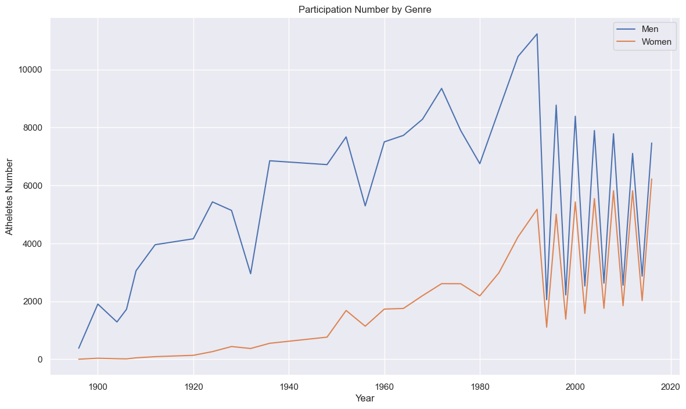
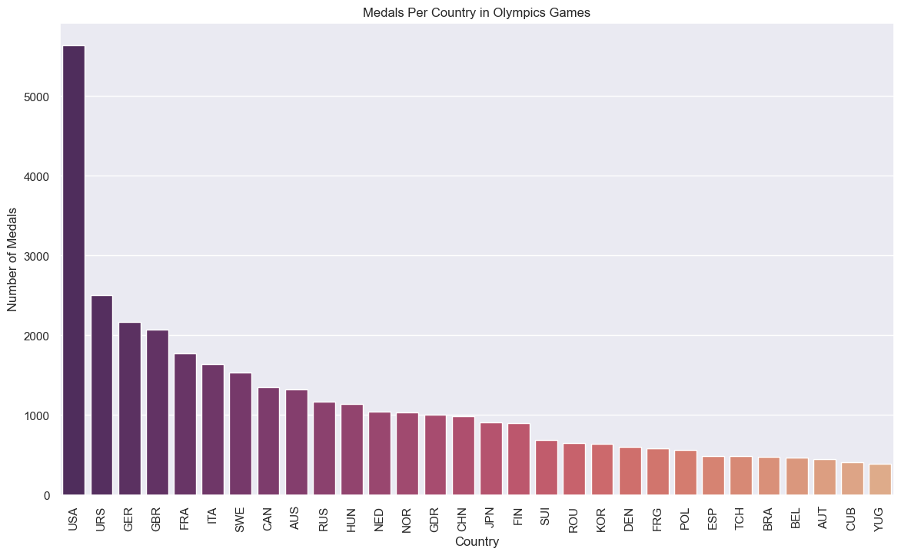
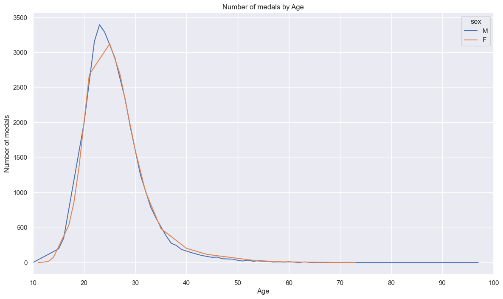

# Milestone 2: Descriptive Stats

**1. Provide a summary of the different descriptive statistics you looked at and WHY.**
 
   *To achieve the business objectives I would try to answer each of the hypotheses questions presented in the Milestone 1. Even if the hypotheses are not true, it does not matter, since it would help to get some insights from the data.*

- *Countries at higher latitudes have better performance (medals) in Winter Sports*.

   As we can see the TOP-20 countries with more amount of medals are those with typically have long and hard strong winters, making sense that are most used to winter sports, or invest more money in this kind of sports.

   

- *Female and Male participants tend to be equilibrated over the years.*

   The plot shows larger male participation in the Olympic Games vs female participation up to approximately 1990. In the last 3 decades, the participation of both genres has followed the same trend, being slightly larger for men than women. However, it looks like this trend would converge for equality in the next years or soon decade.

   

- *Developed countries have more medals on their records.*

   The TOP-30 countries with more medals in their records are somehow related to a larger GDP, or at least they are not countries with the lowest GDP. It is noticeable, that even if there are countries whose GDPs are not maybe the best, these countries have a strong a solid culture on sports (e.g.: URSS ex-countries or east-Europe.)

   

- *It has to be an age of around 25 years, for the best winning medals.*

   It can be seen that for both genres, the average age for winning more medals in the Olympics is at the age of 25+/-5 years.

      

**1. Submit 2-3 key points you may have discovered about the data, e.g. new relationships? Aha's! Did you come up with additional ideas for other things to review?**

   - *There is some drop in men's participation in the Olympics in some years, it could be interesting to find out why.*
   - *Some countries do not exist anymore, or they have a new NOC, these medals should be added if the country has not changed geographically quite a lot.*
   - *In the case of the URSS, the medallist country should be 'changed' to the actual country, but this could carry out some political issues.*

**2. Did you prove or disprove any of your initial hypotheses? If so, which one and what do you plan to do next?**
   
   *I prove that most of the hypotheses established in the beginning were right. However, it should be checked deeper into the data to get better insights. Until now, these results are barely shallow and should be understood as a general trend.*

**3. What additional questions are you seeking to answer?**

   - *Grouping Ex-URSS countries together.*
   - *In the case of USA, race of the winners (e.g: how many Jamaicans run for USA, etc...)*
   - *The distribution of age and Medal type (Gold, Silver, Bronze)*
   - *The ratio between age and year by Medal type (e.g: if the average age of winning Silver is 30 years old, how has this evolved with the years)*
   - *Dropping sports that have appeared in the Olympics just a few times (Roque, Basque Pelota, Areonautics)*