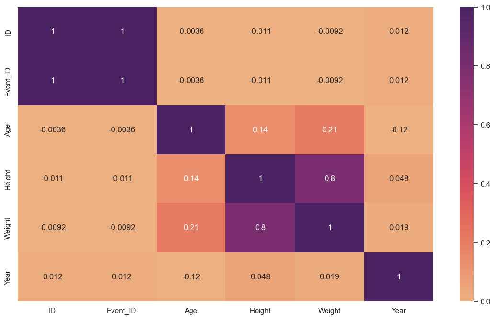
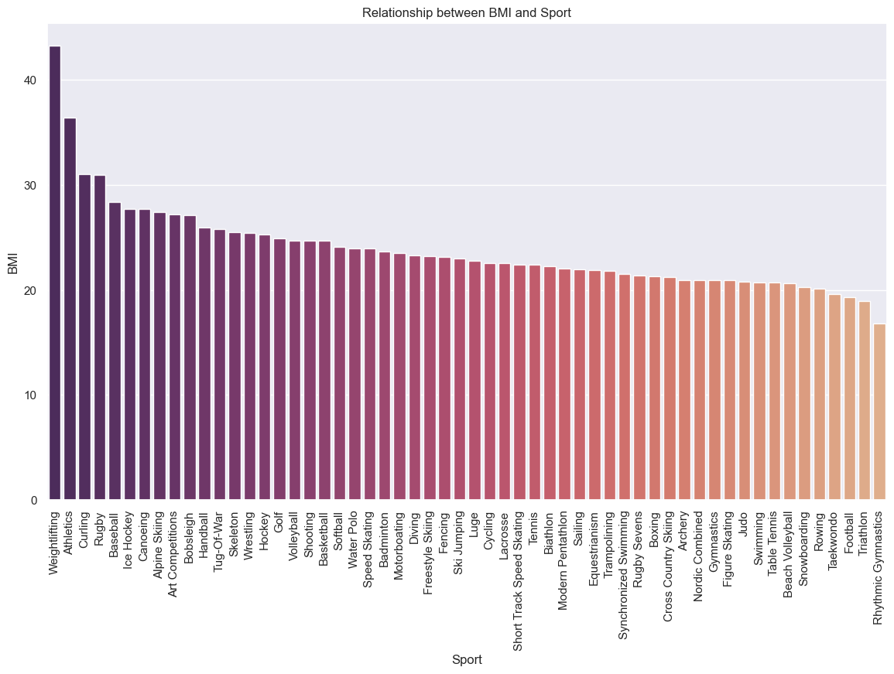
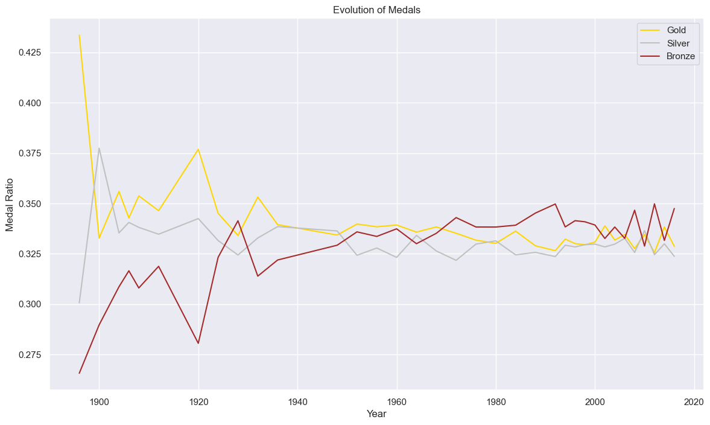
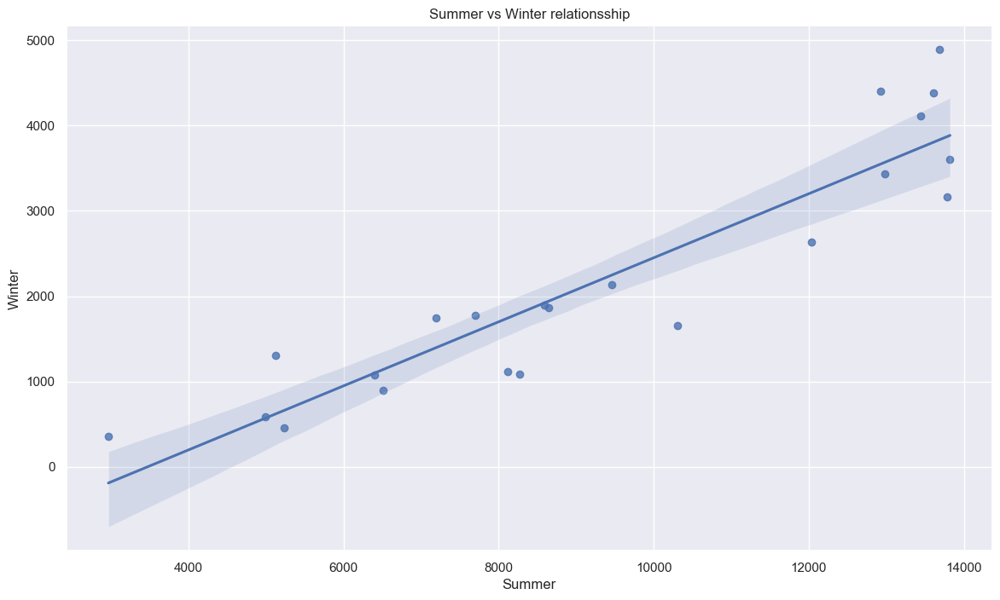

# Milestone 3: Beyond DEscriptive Stats 

****Dive Deeper**

*In this Milestone, I would look through correlations between features that initially were missed. For that, Pearson correlation can be useful as well as a heatmap between features.*

*It appears a Person's Correlation of 0.8 between Weight and Height, implying that these two features are quite related, as expected.*

**Go Broader**

*Let's examine which is the average BMI for each sport for the entries that we have enough data. We can see that the sports with the largest BMI are Weightlifting and Athletics, while Rhythmic Gymnastics has the lowest BMI, followed by Triathlon. Surprisingly, Curling is the 3rd sport with the largest BMI, above Ice Hockey or Rugby.*

*We can see also, that the evolution of the medals ratio has tended to be stabilized over the years, most probably a change in the regulations, or tech advances.*

*It exists a strong correlation of about 0.94 between the number of medals won in Summer and Winter Sports.*

**New Metric**

- BMI: indicates a proper or suitable sport for an athlete
- Medal Ratio: Indicative of the distribution of medals
